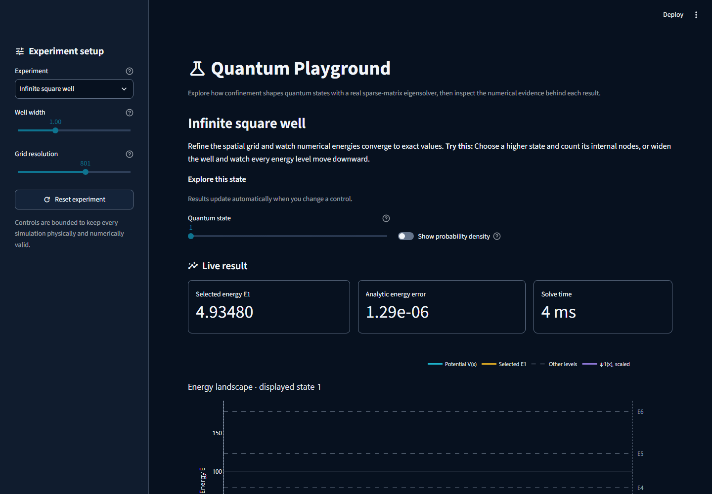

# Quantum Playground

[](https://quantum-playground-app.streamlit.app)
[](https://github.com/sebasalonsogp/Quantum-Playground/actions/workflows/ci.yml)

An interactive scientific-computing showcase for exploring how one-dimensional potential-energy
landscapes determine quantum energy levels, wavefunctions, and probability densities.

Inspired by quantum-mechanics topics from my physics classes, I built Quantum Playground to turn
those ideas into an interactive experience while demonstrating scientific computing, numerical
methods, and software engineering.

[](https://quantum-playground-app.streamlit.app)

## Try the flagship interaction

Open the [live app](https://quantum-playground-app.streamlit.app), choose **Symmetric double
well**, and raise the barrier height or well separation. The lowest two energy levels move toward
degeneracy as tunneling is suppressed. A fixed default comparison makes the collapsing energy split
visible immediately. Then switch to **Tunneling motion** and drag through one cycle to move a
normalized probability density from one well to the other. Live left-well probability, the
tunneling period, and expandable diagnostics connect the interaction to the underlying numerics.

The complete two-minute path is:

`choose an experiment → change a parameter → observe the physics → read the explanation → verify the numerics`

## What this project demonstrates

| Area | Evidence |
| --- | --- |
| Scientific computing | Sparse finite-difference Hamiltonians and shift-invert eigenvalue solving with NumPy and SciPy |
| Numerical credibility | Analytic checks, eigenpair residuals, normalization, orthogonality, and measured second-order convergence |
| Product engineering | Three curated experiments, a tunneling-cycle scrubber, responsive Plotly figures, keyboard-accessible Streamlit UI, and actionable failure states |
| Software quality | Typed immutable models, read-only numerical results, a comprehensive automated test suite, frozen dependencies, and GitHub Actions |
| Performance | Representative solver medians of 1.9–6.4 ms and hosted-style interaction medians near 60 ms on the recorded development machine |

## Experiments

- **Infinite square well:** compare computed levels with an exact spectrum and run an on-demand grid
  convergence study.
- **Harmonic oscillator:** change the confinement frequency and observe uniform level spacing and
  spatial contraction.
- **Symmetric double well:** explore tunneling partners, parity, the lowest even/odd energy split,
  and the time evolution of their localized superposition.

Every experiment follows one numerical path:

`bounded controls → sampled V(x) → sparse Hamiltonian → eigenpairs → diagnostics → visualization`

## Run locally

Prerequisites: [Git](https://git-scm.com/) and [uv](https://docs.astral.sh/uv/).

```powershell
git clone https://github.com/sebasalonsogp/Quantum-Playground.git
cd Quantum-Playground
uv sync --locked --all-groups
uv run streamlit run app.py
```

Then open `http://localhost:8501`.

## Verify the project

```powershell
uv run ruff format --check .
uv run ruff check .
uv run pytest
uv build
uv run python scripts/benchmark_runtime.py
```

The benchmark records uncached default and maximum-resolution solver paths plus initial, cached
visual, and uncached physical-control reruns through Streamlit AppTest. It reports timing evidence
without turning machine-dependent performance into a flaky test gate.

## Architecture and scope

The Streamlit shell depends on a UI-independent scientific package containing immutable models,
potential definitions, the sparse solver, validation, and visualization. Scientific logic never
enters the app layer, and every user control is validated before computation.

The MVP intentionally excludes arbitrary expressions, time dependence, extra dimensions, accounts,
databases, and a separate API. A bounded potential composer remains the preferred post-launch
extension only if user evaluation shows it improves the portfolio experience.

- [Product brief](docs/product-brief.md)
- [Architecture](docs/architecture.md)
- [Implementation plan](tasks/plan.md)
- [Release and demo runbook](docs/release.md)
- [Changelog](CHANGELOG.md)

## Technology

Python 3.12 · NumPy · SciPy · Streamlit · Plotly · pytest · Ruff · uv · GitHub Actions
